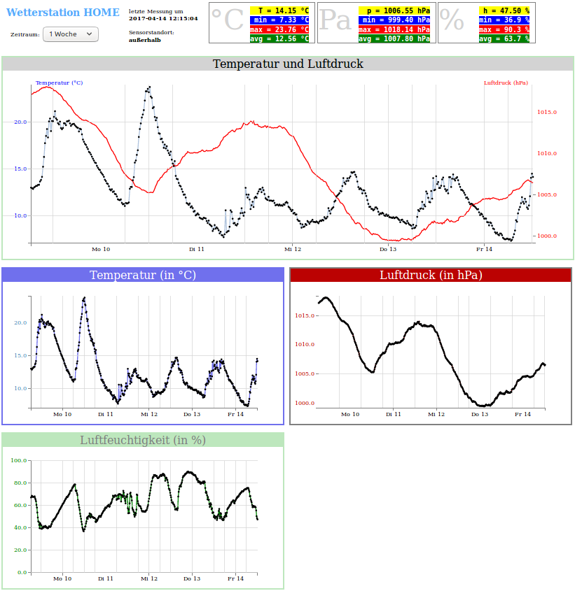

# Wetterstation
Aufbau einer Wetterstation mit Raspberry Pi und mehreren Sensoren - Programmiersprache: Python

## Bauteile:

Raspberry Pi 3  (funktioniert auch mit Version 2)
BME280 - Sensor zur Erfassung von Temperatur, Druck, Luftfeuchtigkeit (Bezug: Watterott.com)
BMP280 -  Sensor zur Erfassung von Temperatur, Druck  (Bezugs: Adafruit)

Die Sensoren gibt es auch sehr preisgünstig über ebay aus China

## Messung

Die Wetterdaten werden alle 15 Minuten gemessen und in einer externen MySQL-Datenbank gespeichert. Ein Webserver liest diese Daten aus und stellt die Daten grafisch dar.

Beispiel:  https://gussmann-berlin.de/wetter/wetterhome.php

## Ergänzungen

1. Über einen kleinen OLED-Screen sollen auf Tastendruck die aktuellen Werte
angezeigt werden.

2. Ergänzung um einen Feinstaubsensor

3. Ergänzung um den günstigeren Chip BMP280 mit angepasster Bibliothek

