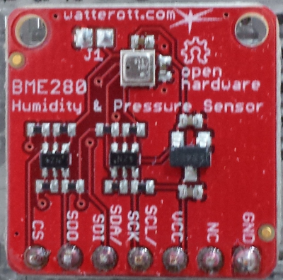

# Wetterdaten mit dem Raspberry Pi messen

**Ziel:** Mit zwei Sensoren und einem Raspberry Pi soll die Temperatur,
    Luftdruck und Luftfeuchtigkeit an zwei Stellen (outdoor/indoor9 gemessen werden.  

## Hardware

- Raspberry Pi 3 (geht auch mit älteren Modellen + WLAN-Modul)
- BOSCH BME280   (Bezugsquelle: watterott.com)
- Adafruit BMP280 (Versuchsweise, ohne Luftfeuchtigkeit)



## Anschluss der Sensoren

```
  Sensor          Raspberry Pi
      GND ------- GND 
       NC -------
      VCC ------- +3.3V
  SCL/SCK ------- SCL
  SDA/SDI ------- SDA
      SD0 ------- *      
       CS -------
```

Mit SD0 kann die I2C-Adresse geändert werden. Standardmäißg besitzt der Chip
die Adresse 0x77. Wird SD0 auf HIGH gelegt, so ändert sich die Adresse zu 0x76.

## Software

Über Adafruit kann eine Bibliothek zu diesem Chip installiert werden. Diese
Bibliothek setzt die Installation von Adafruit_GPIO voraus. Weitere
Informationen über https://github.com/adafruit.

Mit dieser Bibliothek können die Messdaten einfach eingelesen werden:

```
#!/usr/bin/python 
# -*- coding: utf-8 -*-

from Adafruit_BME280 import *
import time
import urllib

sensor = BME280(mode=BME280_OSAMPLE_8)

degrees = sensor.read_temperature()
pascals = sensor.read_pressure()
hectopascals = pascals / 100
humidity = sensor.read_humidity()

print ("Temperatur (in C)   = {0:0.3f} C".format(degrees))
print ("Luftdruck (in hPa)  = {0:0.2f} hPa".format(hectopascals))
print ("Luftfeuchtigkeit    = {0:0.2f} %".format(humidity))
```

## Speicherung der Messdaten auf (externer) Datenbank

Die gemessenen Werten sollen in einer Datenbank gespeichert werden, die sich
irgendwo auf einem Server befindet. Dazu wird auf diesem Server eine
upload-php-Seite angelegt, über die mit angehängten Parametern die Speicherung
erfolgt (näheres unter mysql).

Ergänzungen des Pythonprogramms:

```
import urllib

url = "http://<server>/upload.php?m=outdoor&t=" +str(round(degrees, 2)) + "&p=" +str(round(hectopascals, 2)) + "&f=" + str(round(humidity, 2))
urllib.urlopen(url)
```


